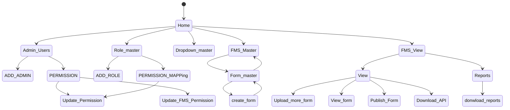
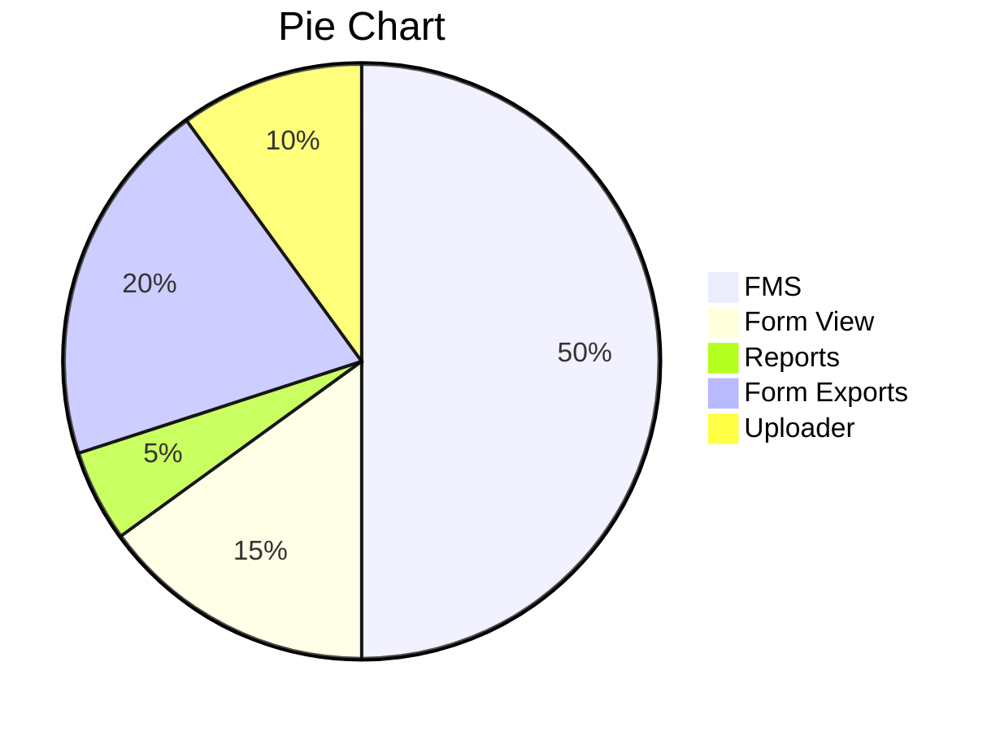

# Form Management System (FMS)

A dynamic **Form Management System** that allows users to create, share, and manage custom forms effortlessly.

This project is designed as a lightweight alternative to tools like Google Forms, focused on flexibility, simplicity, and developer control.

---

## Overview

The Form Management System (FMS) enables users to:

- Create dynamic forms with customizable fields
- Share forms via unique links
- Collect and store responses in structured format
- Manage submitted data efficiently

It is ideal for:
- Surveys
- Feedback collection
- Internal workflows
- Data gathering

---

## Features

-  Dynamic form builder (no fixed structure)
-  Shareable form links
-  Response collection & storage
-  User authentication (ID & Password based)
-  API support (Postman ready JSON format)
-  Lightweight and fast

---

##  System Workflow

```text
Step 1: User creates a FMS 
Step 2: System generates FMS_ID 
Step 3: FMS have multiple form 
Step 4: Form have multiple sub-form (and all have multiple paramter , type based )
Step 5: if you want to view the form then Going to FMS View options the View the form on 
        particular FMS > Form Name => which you want to view
````

---

##  Technical Flow

1. Retrieve:
    * FMS_ID
    * Form_ID
    * Form Name
2. Call:

   ```
   loadFSM()
   loadFormId()
   ```

3. Process:
    * Export required data into `$data = []`
4. Set:
    * Required headers for API requests
---

## API Usage

* API responses are available in **JSON format**
* Can be directly imported into **Postman**

### Steps:

1. Open Postman
2. Click on **Import**
3. Upload the exported API file
4. Execute requests

>  Note: User authentication (User ID & Password) is required for sending requests.

---


## Sample Data Structure

| Field Name | Type   | Description      |
| ---------- | ------ | ---------------- |
| form_id    | int    | Unique Form ID   |
| name       | string | User Name        |
| email      | string | User Email       |
| response   | text   | Submitted Answer |

---

## Future Scope

* Analytics Dashboard
* Role-based access system
* Export responses (CSV, Excel)

 
### Process of the Applications



### Scope of FMS in Application 

